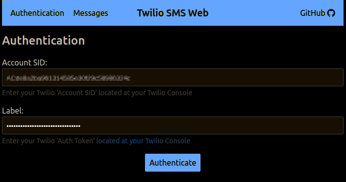
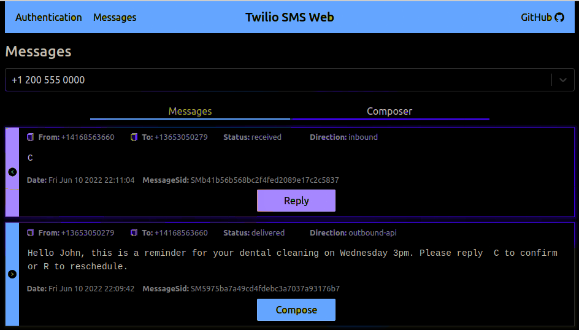
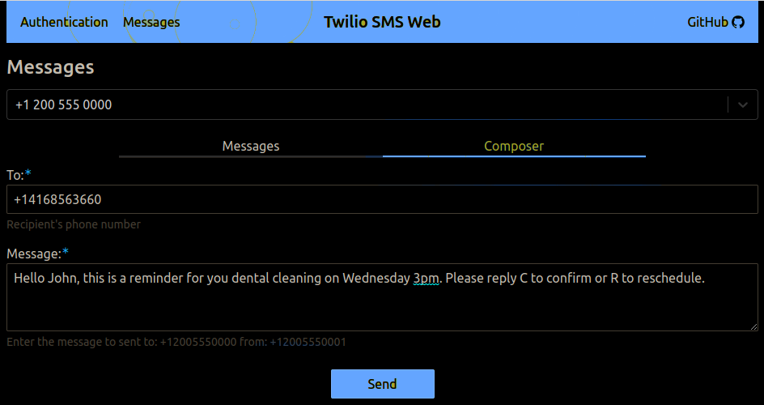

Twilio SMS Web
==============
A minimalist web application to send and receive SMS with Twilio.

Hosted Application
==================
A version of this application is available on GitHub Pages:

https://413D3Z.github.io/Twilio-SMS-SendnReceive

Twilio Account
==============
You will need a Twilio account to read and send SMS messages.

Twilio Free Account
-------------------
If you don't have an account, Twilio offers a [free trial account][TwilioFreeTrial].
Once your account is created you will need to [verify your personal phone number][TwilioVerifyPersonalPhoneNumber].
Finally, you also need to [get a Twilio phone number with SMS capability][TwilioGetPhoneNumber].

Sign-in to Twilio SMS Web
-------------------------
1. Sign-in to Twilio and get your `ACCOUNT SID` and `AUTH TOKEN` on the [Twilio's Console Page][TwilioConsole].
2. Use your `ACCOUNT SID` and `AUTH TOKEN` to sign-in to [Twilio SMS Web][HostedDemo].

Screenshots
===========
Sign-in

Read messages:

Compose messages:

